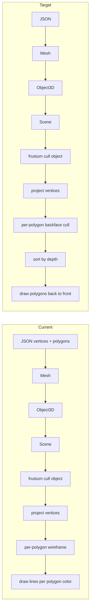

# Advanced Wireframe Engine: Incremental Plan and Current State

## Incremental Plan (As If Starting From Scratch)

The following is a minimal sequence of steps to reach the target feature set.

### Phase 1: Foundation

1. **Math engine**  
   Vec2, Vec3, Vec4 (dot, cross, normalize, length), Mat4 (multiply, transformVec4, translation, scaling, rotationX/Y/Z, perspective), Quat (identity, fromEuler, conjugate, toMat4). Required for all later steps.

2. **Projection pipeline**  
   Viewport type; NDC → screen mapping (with Y flip); `projectPoint(point, mvp, viewport)` returning screen (x, y), clip w, and a `behind` flag (e.g. when clip.w < 0 or z outside [-1, 1]). Establishes local → world → camera → clip → NDC → screen.

3. **Scene and camera**  
   Camera: position (Vec3), orientation (Quat), fov/near/far; `getViewMatrix()` (inverse of camera transform), `getProjectionMatrix(aspect)`. Scene: list of objects + active camera.

4. **Object transform**  
   Object3D: mesh reference, position, rotation (Euler or quat), scale; `getModelMatrix()` (T×R×S). Enables placing the same mesh at different world positions.

5. **Mesh representation (wireframe)**  
   Mesh = `vertices: Vec3[]` (local positions) + `polygons: { color, vertexIndices }[]`. Edges are implied by polygon vertex order (draw 1-2, 2-3, …, n-1). Precompute bounding radius from vertices for culling.

6. **IO and wireframe rendering**  
   Load mesh JSON (vertices + polygons). Render loop: for each object, MVP = viewProj × model; project vertices; per polygon, draw lines between consecutive vertex indices (and last to first) where all vertices valid and not behind; draw in polygon color. Result: rotatable wireframe objects.

### Phase 2: Culling and Visibility

7. **Object-level frustum culling**  
   Use mesh bounding sphere (center in world, radius from mesh). Transform center to camera space (or test in clip space). Test sphere against view frustum (or a cheap subset: e.g. near/far planes and a conservative FOV cone or clip-space AABB). Skip projecting/drawing the whole mesh if the sphere is outside. Reduces work for off-screen objects.

8. **Polygon representation**  
   Mesh data: vertices (Vec3[]) + polygons = `{ color: string, vertexIndices: number[] }[]`. No separate edge list; polygon vertexIndices reference vertices, and edges are implied (1-2, 2-3, …, n-1). Polygon is the unit of rendering and culling.

### Phase 3: Polygon Rendering and Ordering

9. **Rendering by polygon**  
   For each object (after culling): project vertices. For each polygon: map vertex indices to projected 2D points; if all vertices valid and not behind, draw that polygon's boundary (1-2, 2-3, …, n-1) in polygon color (wireframe), or fill (Canvas path + fill). Draw per-polygon, not whole-mesh edge list.

10. **Backface culling**  
    For each polygon: in camera space (or using view direction), compute outward normal (e.g. cross of (p1−p0)×(p2−p0) from first three vertices). If dot(normal, viewDir) ≥ 0 (facing away), skip drawing. Only front-facing polygons are rendered. Vec3 dot/cross and a consistent vertex winding in the data are enough.

11. **Painter's algorithm**  
    Collect all visible polygons (after backface culling) across all objects; assign a depth per polygon (e.g. average z or max z in camera space). Sort by depth descending (farthest first). Draw in that order so nearer polygons overwrite farther ones. Requires drawing filled polygons (or at least ordered wireframe) to get correct occlusion.

---

## Where You Are Now

| Step | Status | Evidence |
|------|--------|----------|
| 1. Math engine | Done | `src/math/`: vec2/vec3/vec4 (dot, cross, normalize), mat4 (perspective, etc.), quat (conjugate, toMat4). |
| 2. Projection pipeline | Done | `src/math/projection.ts`: `projectPoint`, NDC→screen, `behind` when clip.w<0 or z outside [-1,1]. |
| 3. Scene and camera | Done | `src/core/Camera.ts`, `src/core/Scene.ts`: Quat camera, view/projection matrices. |
| 4. Object transform | Done | `src/core/Object3D.ts`: position, Euler rotation, scale, `getModelMatrix()`. |
| 5. Mesh (wireframe) | Done | `src/core/Mesh.ts`: vertices (Vec3[]), polygons, `boundingRadius` from vertices. No separate edge list; polygon vertexIndices imply edges (1-2, 2-3, …, n-1). |
| 6. IO + wireframe render | Done | `src/io/meshLoader.ts` loads vertices + polygons; `renderHelpers.ts` + `index.ts`: MVP, project vertices, draw per-polygon wireframe. |
| 7. Frustum culling | Done | `src/math/frustum.ts`: `isSphereInFrustum`; `projectSceneToPolygonWireframe` skips objects whose bounding sphere is outside the view frustum. |
| 8. Polygon representation | Done | Mesh = vertices + polygons; JSON has `vertices` and `polygons` with `color` and `vertexIndices` (indices into vertices). Edges implied by polygon vertex order. |
| 9. Render by polygon | Done | `projectSceneToPolygonWireframe`: per object (after cull), per polygon, project vertex indices and draw polygon boundary (1-2, 2-3, …, n-1) in polygon color. |
| 10. Backface culling | Not done | All polygons drawn; no normal/viewDir test to skip back-facing polygons. |
| 11. Painter's algorithm | Not done | No depth sort; polygons drawn in scene order. No filled polygons for correct occlusion. |

**Summary:** You have completed **Phase 1** (steps 1–6) and **Phase 2** (steps 7–8), plus **Step 9** (render by polygon with color). Representation is vertices + polygons only (no explicit edge list). **Remaining:** Step 10 (backface culling), Step 11 (painter's algorithm / depth sort); add filled polygon drawing for correct occlusion if desired.

---

## Pipeline Overview (Current vs Target)

---

## Recommended Next Steps (In Order)

1. **Step 10: Backface culling**  
   - For each polygon, compute normal in camera space from first three vertices; if dot(normal, view direction) ≥ 0, skip.  
   - Requires view direction or camera-space positions; use existing view matrix and vertex transform.  
   - Files: `renderHelpers.ts` (or a small geometry helper).

2. **Step 11: Painter's algorithm**  
   - Flatten visible polygons (after backface cull) across all objects; assign depth (e.g. average or max z in camera space).  
   - Sort by depth descending; draw in that order so nearer polygons overwrite farther ones.  
   - True occlusion requires filled polygons; add `fillPolygon` to Canvas if desired.  
   - Files: `renderHelpers.ts`, `Canvas.ts` for filled polygons.

---

## Optional: Filled Polygons

The painter's algorithm is only meaningful for occlusion when polygons are **filled**. Right now `Canvas` has `drawLine`/`drawLines` only. Adding something like `fillPolygon(screenPoints: Array<{x,y}>, color)` (Canvas 2D `beginPath`, `moveTo`/`lineTo`, `fill`) will allow solid-colored polygons and correct depth ordering. Wireframe-on-top can be a second pass if desired.

---

## Summary

- **Incremental plan:** 11 steps in three phases (math + pipeline + wireframe → culling + polygons → polygon render + backface + painter's).
- **Current position:** Steps 1–9 done. Mesh = vertices + polygons (no separate edge list); JSON = `vertices` + `polygons`; frustum culling and per-polygon wireframe with color are in place.
- **Next steps:** Step 10 (backface culling), then Step 11 (painter's algorithm / depth sort); add filled polygon drawing if you want correct occlusion.
