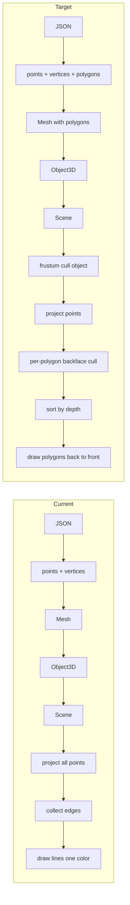

# Advanced Wireframe Engine: Incremental Plan and Current State

## Incremental Plan (As If Starting From Scratch)

The following is a minimal sequence of steps to reach the target feature set.

### Phase 1: Foundation

1. **Math engine**  
   Vec2, Vec3, Vec4 (dot, cross, normalize, length), Mat4 (multiply, transformVec4, translation, scaling, rotationX/Y/Z, perspective), Quat (identity, fromEuler, conjugate, toMat4). Required for all later steps.

2. **Projection pipeline**  
   Viewport type; NDC → screen mapping (with Y flip); `projectPoint(point, mvp, viewport)` returning screen (x, y), clip w, and a `behind` flag (e.g. when clip.w < 0 or z outside [-1, 1]). Establishes local → world → camera → clip → NDC → screen.

3. **Scene and camera**  
   Camera: position (Vec3), orientation (Quat), fov/near/far; `getViewMatrix()` (inverse of camera transform), `getProjectionMatrix(aspect)`. Scene: list of objects + active camera.

4. **Object transform**  
   Object3D: mesh reference, position, rotation (Euler or quat), scale; `getModelMatrix()` (T×R×S). Enables placing the same mesh at different world positions.

5. **Mesh representation (wireframe)**  
   Mesh = `points: Vec3[]` (local positions) + `vertices: [number, number][]` (edge index pairs). Optional: precompute bounding radius from points for later culling.

6. **IO and wireframe rendering**  
   Load mesh JSON (points + vertices). Render loop: for each object, MVP = viewProj × model; project all mesh points; build line segments from edges where both endpoints are valid and not behind; draw segments (single color). Result: rotatable wireframe objects.

### Phase 2: Culling and Visibility

7. **Object-level frustum culling**  
   Use mesh bounding sphere (center in world, radius from mesh). Transform center to camera space (or test in clip space). Test sphere against view frustum (or a cheap subset: e.g. near/far planes and a conservative FOV cone or clip-space AABB). Skip projecting/drawing the whole mesh if the sphere is outside. Reduces work for off-screen objects.

8. **Polygon representation**  
   Extend mesh data: polygons = `{ color: string, vertexIndices: number[] }[]`. Load from JSON (your format already has this). Mesh stores `points`, `vertices` (edges), and `polygons`. Decide whether edges are derived from polygon boundaries or kept separate for wireframe. Polygon is the unit of rendering and culling from here on.

### Phase 3: Polygon Rendering and Ordering

9. **Rendering by polygon**  
   For each object (after culling): project only the points that are referenced by polygons (or all points). For each polygon: map vertex indices to projected 2D points (and keep depth); if all vertices valid and not behind, draw that polygon (wireframe: polygon edges in polygon color; or filled: Canvas path + fill with polygon color). Replace "draw whole mesh as one edge list" with "draw per-polygon."

10. **Backface culling**  
    For each polygon: in camera space (or using view direction), compute outward normal (e.g. cross of (p1−p0)×(p2−p0) from first three vertices). If dot(normal, viewDir) ≥ 0 (facing away), skip drawing. Only front-facing polygons are rendered. Vec3 dot/cross and a consistent vertex winding in the data are enough.

11. **Painter's algorithm**  
    Collect all visible polygons (after backface culling) across all objects; assign a depth per polygon (e.g. average z or max z in camera space). Sort by depth descending (farthest first). Draw in that order so nearer polygons overwrite farther ones. Requires drawing filled polygons (or at least ordered wireframe) to get correct occlusion.

---

## Where You Are Now

| Step | Status | Evidence |
|------|--------|----------|
| 1. Math engine | Done | `src/math/`: vec2/vec3/vec4 (dot, cross, normalize), mat4 (perspective, etc.), quat (conjugate, toMat4). |
| 2. Projection pipeline | Done | `src/math/projection.ts`: `projectPoint`, NDC→screen, `behind` when clip.w<0 or z outside [-1,1]. |
| 3. Scene and camera | Done | `src/core/Camera.ts`, `src/core/Scene.ts`: Quat camera, view/projection matrices. |
| 4. Object transform | Done | `src/core/Object3D.ts`: position, Euler rotation, scale, `getModelMatrix()`. |
| 5. Mesh (wireframe) | Done | `src/core/Mesh.ts`: points, vertices (edges), `boundingRadius` computed. |
| 6. IO + wireframe render | Done | `src/io/meshLoader.ts` loads points/vertices; `src/core/renderHelpers.ts` + `src/index.ts`: MVP, project points, collect segments, draw lines. |
| 7. Frustum culling | Not done | `Mesh.boundingRadius` exists but is never used; no sphere-vs-frustum test; every object is fully projected and drawn. |
| 8. Polygon representation | Data only | `src/assets/cube.json` has `polygons` with `color` and `vertexIndices`; `MeshData`/`Mesh` do not; loader drops polygons. |
| 9–11. Polygon render, backface, painter's | Not done | Rendering is whole-mesh edges only; no per-polygon color, no normals, no depth sort. |

**Summary:** You have completed **Phase 1** (steps 1–6). You have **no** object-level frustum culling (step 7), and **no** in-memory polygon representation or polygon-based rendering (steps 8–11). Per-point "behind" checks only hide individual points/edges; they do not cull whole objects.

---

## Pipeline Overview (Current vs Target)

---

## Recommended Next Steps (In Order)

1. **Step 7: Object-level frustum culling**  
   - Add a helper that tests a world-space sphere (e.g. object position + mesh bounding radius, or transformed local center + radius) against the view frustum (at least near/far and a simple FOV or clip-space test).  
   - In `projectSceneToLineSegments` (or equivalent), skip any object whose bounding sphere is fully outside.  
   - Files: new helper (e.g. `frustum.ts` or in `projection.ts`), `renderHelpers.ts`, and Scene/Camera for view/projection if needed.

2. **Step 8: Polygon representation in Mesh and loader**  
   - Extend `MeshData` and `Mesh` with `polygons: { color: string; vertexIndices: number[] }[]`.  
   - In `meshLoader.ts`, parse and pass through `json.polygons`.  
   - Keep existing `points` and `vertices` so current wireframe path still works until step 9 is in place.  
   - Files: `src/io/meshLoader.ts`, `src/core/Mesh.ts`.

3. **Step 9: Render by polygon**  
   - Add a path that, per object, iterates polygons: for each polygon, project its vertex indices, and if all visible, draw that polygon's edges (and optionally fill) with the polygon's color.  
   - Switch the main render path from "all edges, one color" to this polygon loop, or make it configurable (wireframe-by-mesh vs wireframe-by-polygon).  
   - Files: `renderHelpers.ts`, `Canvas.ts` (e.g. `drawPolygon` for fill if desired), `index.ts`.

4. **Step 10: Backface culling**  
   - For each polygon, compute normal in camera space from first three vertices; if dot(normal, view direction) ≥ 0, skip.  
   - Requires view direction or camera-space positions; use existing view matrix and point transform.  
   - Files: `renderHelpers.ts` (or a small geometry helper).

5. **Step 11: Painter's algorithm**  
   - Flatten visible polygons (with object + polygon identity and depth).  
   - Assign depth (e.g. average or max z in camera space).  
   - Sort by depth descending; draw in that order.  
   - If you only draw wireframe, overlap order may still be wrong; true occlusion needs filled polygons.  
   - Files: `renderHelpers.ts`, `Canvas.ts` for filled polygons.

---

## Optional: Filled Polygons

The painter's algorithm is only meaningful for occlusion when polygons are **filled**. Right now `Canvas` has `drawLine`/`drawLines` only. Adding something like `fillPolygon(screenPoints: Array<{x,y}>, color)` (Canvas 2D `beginPath`, `moveTo`/`lineTo`, `fill`) will allow solid-colored polygons and correct depth ordering. Wireframe-on-top can be a second pass if desired.

---

## Summary

- **Incremental plan:** 11 steps in three phases (math + pipeline + wireframe → culling + polygons → polygon render + backface + painter's).
- **Current position:** Steps 1–6 done; 7 (frustum culling) and 8–11 (polygons, backface, painter's) not done; polygon data exists in JSON but is not loaded or used.
- **Next steps:** Implement 7 (frustum culling), then 8 (polygons in Mesh/loader), then 9 (render by polygon with color), then 10 (backface culling), then 11 (painter's algorithm); add filled polygon drawing if you want correct occlusion.
